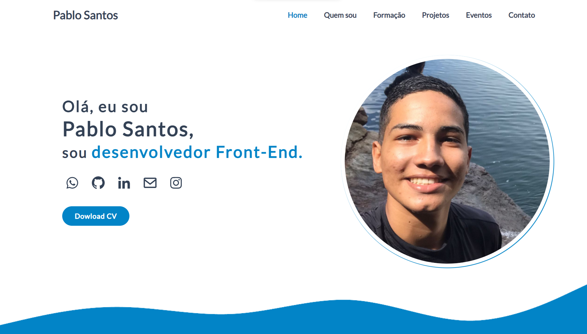

<h1 align="center">
  💻 Portfólio -  Pablo Santos
</h1>

<h4 align="center"><a href="https://pablo-m-santos.github.io/Portfolio/">Clique para visitar o meu projeto ( EM DESENVOLVIMENTO!! )</a></h4>

## 🌳 Projeto
O objetivo do portfólio é colocar meus projetos, informações sobre mim, informar meus conhecimentos, serviços e meu currículo, para a visualização das pessoas/empresas.

## 📃 Seções
O portfólio é composto por 6 seções diferentes:

  -  Seção Home: ** Nele temos uma breve apresentação e além disso, temos botão para baixar meu currículo;
  -  Seção Quem sou: ** Nessa seção tem uma breve descrição dizendo sobre mim;
  -  Seção Formação: ** Aqui apresenta meus conhecimentos e formações como desenvolvedor;
  -  Seção Projetos: ** Apresenta alguns projetos organizados e com link direto para os respectivos códigos no GitHub;
  -  Seção Serviços: ** Exibe através de cartões alguns serviços em que possuo conhecimentos;
  -  Seção Contato: ** Nele temos links de contato e informações;

## 👨🏽‍💻 Tecnologias utilizadas
Para o desenvolvimento do portfólio usei as seguintes tecnologias:
  - Visual Studio Code;
  - HTML ;
  - Css;
  - JavaScript ;

## ⚙️ melhorias e atualizações
O portfólio ainda está em desenvolvimento e as próximas atualizações serão feitas das seguintes maneiras:

  -  [ ] Animação no site;
  -  [ ] Adicionar o tema escuro;
  -  [ ] Adicionar as cores corretas; 
  -  [ ] Melhorias na responsividade mobile;
  -  [ ] Melhoria no layout;
  -  [ ] Adicionar projetos;
  -  [ ] Imagens da minha pessoa;
  -  [ ] Acessibilidade...
